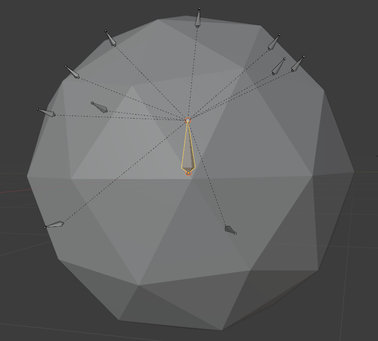

# BoneJuice
Armature utility plugin for Blender, for niche cases I encounter where it would be a lot nicer to have something do the work for me!

Current features include:
- Surface Bone Placer - Quickly place bones on geometric surfaces

# Installation
Download the zip file from the releases area on GitHub, and then go to `Edit > Preferences > Add-ons` and then click `Install` in the top right, and select the zip file. Make sure the plugin it points to is enabled.

If you want the latest version, use `$ make` (Linux-only) inside in this folder to get a zip file, or simply zip up the `src` folder and install that instead.

# Development
This plugin is developed using a custom environment in VS Code. I reccomend using the workspace settings and reccomended extensions.

When setting up, be sure to clone the Blender Python Autocomplete if you use the workspace settings (run inside this repository):
- `$ git clone https://github.com/Korchy/blender_autocomplete.git`

I also highly recommend these VS Code workspace extensions for editing this project.
- jacqueslucke.blender-development
- blenderfreetimeprojects.blender-python-code-templates

The Blender Development plugin is really helpful with it's built-in debugger. Press F1, and run `>Blender: Build and Start` to debug. The workspace configuration should be set up for you already.

# Tools
## Surface Bone Placer
While editing an Armature, go to `Add > Place Surface Bones`. If you would like the bones you place to fall under a parent, make the parent bone active before running this tool.

Once the modal has started, left-click on 3D surfaces to place bones on them. The bone head will fall slightly inside the mesh, and the bone tail will face outward based off the surface normal. Bones should automatically inherit armature and parent bone transforms (essentially they are placed using global space). If there's an issue, let me know.

When you are finished placing bones, hit `Escape` to exit the modal. When using the placed bones, I recommend using Automatic Weights over Envelope weights for inotial weighting of your mesh.

An example of what it does (made center bone active, then used tool to place bones on surface of mesh):

