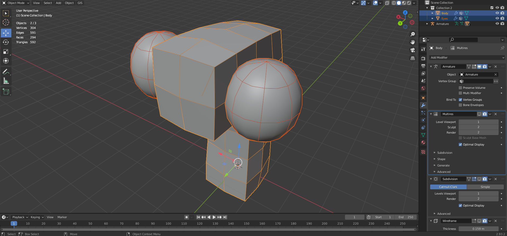
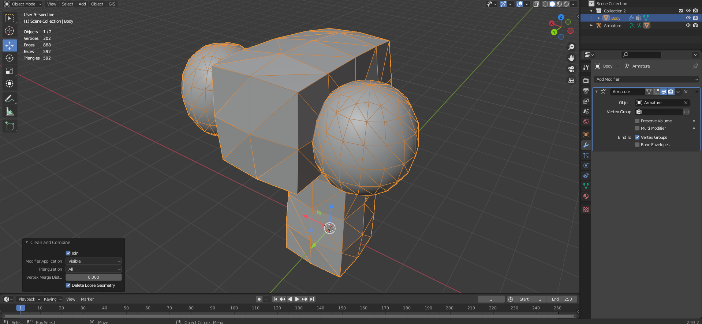
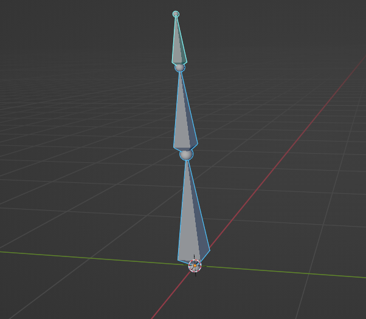
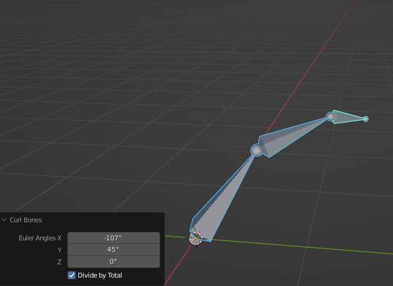

# BoneJuice
Armature utility plugin for Blender, for niche cases I encounter where it would be a lot nicer to have something do the work for me!

Version 0.0.5 which supports Blender 3.0+

Current features include:
- Surface Bone Placer - Place bones on geometric surfaces
- Mark Bone Side - Mark bones as left or right in an armature
- Clean and Combine - Combine multiple meshes, with modifiers, into one export-ready object. Armatures are preserved.
- (Bulk) Set Rotation Mode - Select multiple pose bones and set their rotation mode (Quaternion, XYZ Euler, Axis Angle, etc) with just the click of a button.
- Curl Bones - Offsets euler rotations of all selected pose bones by the given rotation. Only works in Euler rotation mode.

# Installation
Download the zip file from the releases area on GitHub, and then go to `Edit > Preferences > Add-ons` and then click `Install` in the top right, and select the zip file. Make sure the plugin it points to is enabled.

If you want the latest version, use `$ make` (Linux-only) inside in this folder to get a zip file, or simply zip up the `src` folder and install that instead.

# Development
This plugin is developed using a custom environment in VS Code. I reccomend using the workspace settings and reccomended extensions.

When setting up, be sure to clone the Blender Python Autocomplete if you use the workspace settings (run inside this repository):
- `$ git clone https://github.com/Korchy/blender_autocomplete.git`

I also highly recommend these VS Code workspace extensions for editing this project.
- jacqueslucke.blender-development
- blenderfreetimeprojects.blender-python-code-templates

The Blender Development plugin is really helpful with it's built-in debugger. Press F1, and run `>Blender: Build and Start` to debug. The workspace configuration should be set up for you already.

If the debugger is failing to install modules, you may check out this thread [here](https://github.com/JacquesLucke/blender_vscode/issues/99) (I had to run `/home/usrname/.../blender-3.1.0-linux-x64/3.1/python/bin/python3.10 -m ensurepip` before I could use the debugger in Blender 3.1).

# Tools
## Surface Bone Placer
While editing an Armature, go to `Add > Place Surface Bones`. If you would like the bones you place to fall under a parent, make the parent bone active before running this tool.

Once the modal has started, left-click on 3D surfaces to place bones on them. The bone head will fall slightly inside the mesh, and the bone tail will face outward based off the surface normal. Bones should automatically inherit armature and parent bone transforms (essentially they are placed using global space). If there's an issue, let me know.

When you are finished placing bones, hit `Escape` to exit the modal. When using the placed bones, I recommend using Automatic Weights over Envelope weights for inotial weighting of your mesh.

An example of what it does (made center bone active, then used tool to place bones on surface of mesh):

## Mark Bone Side
While editing an Armature, go to `Armature > Names > Mark Side`. This works similar to `Auto-Name Left/Right`, but allows you to set bones to one side or another regardless of actual position when not using the "automatic" setting.

## Clean and Combine
In Object mode, select the objects you want to clean and merge, and make the object you want to merge them into Active. Then, go to `Object > Cleanup > Clean and Combine`. Choose the corresponding settings you like. The resulting objects will have modifiers applied or discarded, be joined together, have geometry cleaned using the given settings, and finally have all transforms applied. This operator is great for multi-part characters, or just generally cleaning up messy files before exporting.

Please note that all modifiers are applied or discarded. **THERE WILL BE DATA LOSS**, but **Armatures and bone weights are preserved**. Though the operator can be undone, it is strongly recommended to have a backup of your model, and only use this tool when you are certain that you want to, or are exporting a model.

## Set Bone Rotation Mode
In Pose mode, select the bones you want to edit, then go to `Pose > Set Rotation Mode`. Choose the rotation mode you want, and all selected pose bones will be set to the new rotation mode. Note that if the bones already have a keyframed rotation, these keyframes will not be converted to the new rotation mode, and you may run into issues with rotation channels clashing.

## Curl Bones
In Pose mode, select the bones you want to edit, then go to `Pose > Curl Bones`. Then input the angle you want to offset the bones' rotation by.

Note that currently this only applies to bones with a Euler rotation mode.