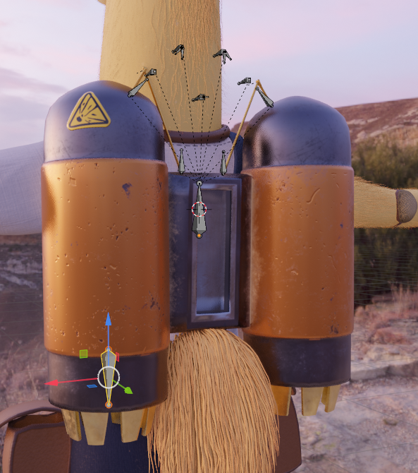
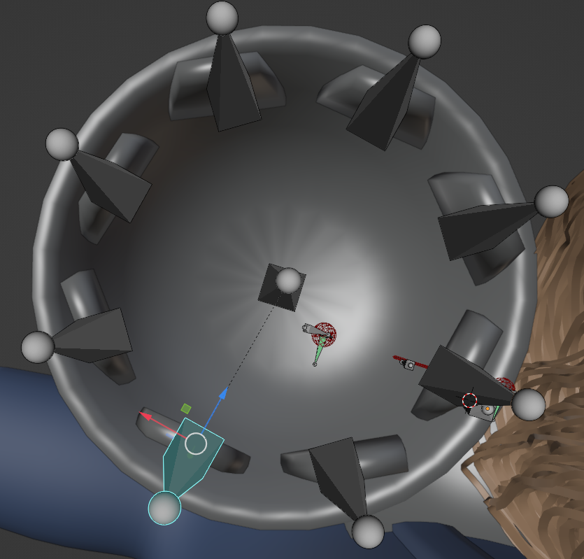
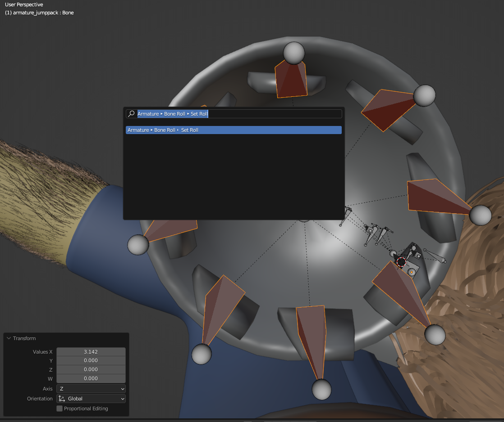
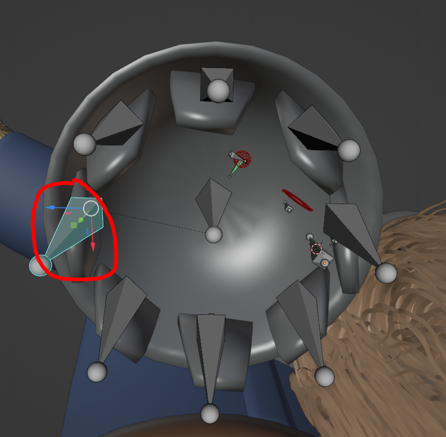
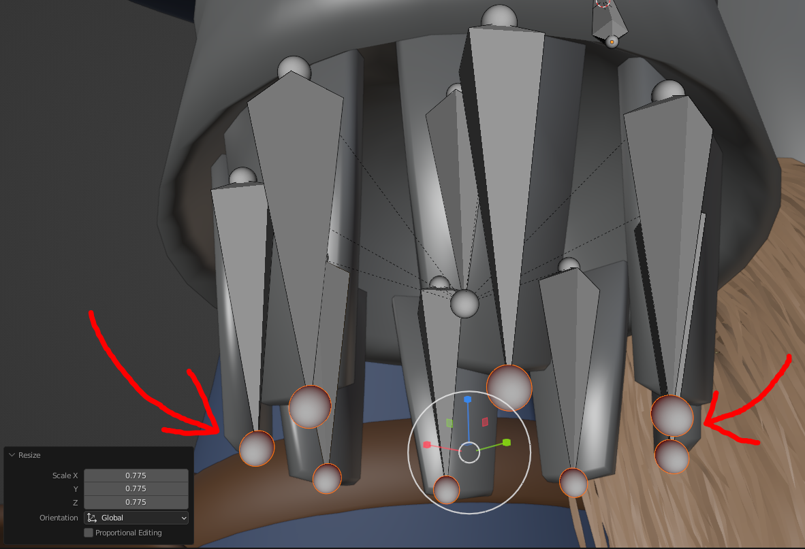

# Add Bone Circle
Creates a circle of bones around the active bone, with bone rolls adjusted to face said active bone.
Useful for radial symmetry.

Additional roll offset can be added with the built-in `Set Roll` command (which takes a roll in radians).

## Accessing
While editing an Armature, go to `Add > Add Bone Circle`.

## Use
Make the bone active you want to place a circle around, and run the operator.

## Example - Jetpack Thruster
Place and make active a bone for the center of your thruster.

Then run `Add > Add Bone Circle`--this will create a circle around your active bone. Adjust settings as needed.

You can see that the bone rolls were adjusted so each bone has the same axis facing the center of the circle.

Also, my bones are spaced evenly, but my fins aren't lining up. That's an issue with how my geometry is placed, not the bones themselves.

If necessary, you can use Blender's built-in `Set Roll` command to adjust the rolls. Note that this takes a value in radians.
Use pi to offset rolls by 180 degrees.

Now our Z axis is facing outward instead of inward!

I also selected the ends of the bones, then scaled them in to create a funneling effect.

