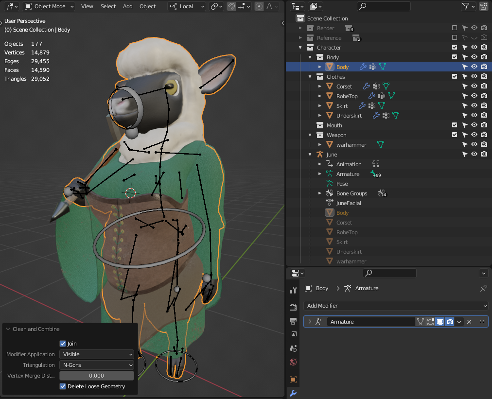
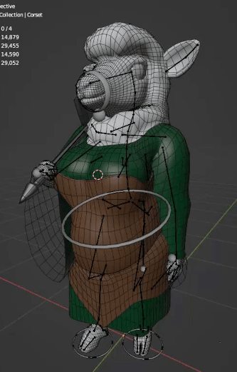

# Clean and Combine
In Object mode, select the objects you want to clean and merge, and make the object you want to merge them into Active.
Then, go to `Object > Cleanup > Clean and Combine`. Choose the corresponding settings you like.
The resulting objects will have modifiers applied or discarded, be joined together, have geometry cleaned using the given settings,
and finally have all transforms applied. This operator is great for multi-part characters,
or just generally cleaning up messy files before exporting.

## Notes
Please note that all modifiers are applied or discarded. **You will lose your modifiers**, but **Armatures and bone weights are preserved**.
Though the operator can be undone, it is strongly recommended to have a backup of your model,
and only use this tool when you are certain that you want to, or are exporting a model.

## Example - Optimizing a Character Rig
Here I have a fairly complicated character model composed of 13 objects, 11 of them are skinned meshes. Ouch!
We also have modifiers to worry about, like these mirrored eyeballs. Since they're the same on either side, I don't
want to apply the mirror modifier while working, but I want to make sure everything I want is applied on exporting.
There's also some render settings that I don't want to use in-game, like the subdivision surface modifier.

I first selected all the body parts I wanted to combine, then control clicked the main body to make it the active object.

After that, I used Clean and Combine on its default settings. Now they're all one object!

Here I did the same with the clothes. Four layers of clothes got merged into one corset!
Now we're down to only 4 objects, and 2 skinned meshes. That was easy!

And our bone weights, armature, and animations were all preserved.
This model is now export-ready for our game engine, or whatever else we intend to use it for. 

