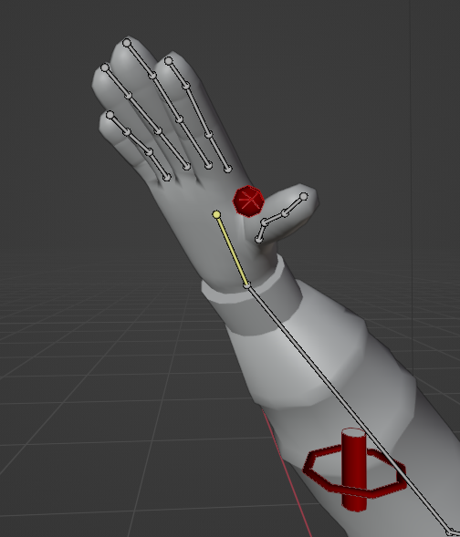
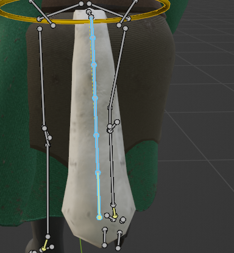
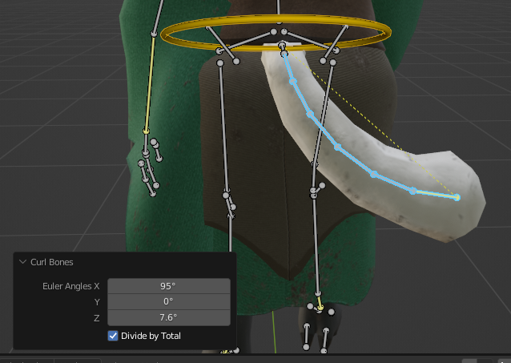

# Curl Bones
In Pose mode, select the bones you want to edit, then go to `Pose > Curl Bones`. Then input the angle you want to offset the bones' rotation by.

## Limitations
Currently this tool only works with bones set to a Euler rotation mode.

Also, be sure your bone rolls are correct when creating your rig, so all the bones' orientations are similar, or at least rotate on the axis you want.

## Example - Curling Fingers
Here I have a hand with 4 fingers I want to curl into a fist or grip. Each finger is composed of 3 bones, each which I have to rotate manually.
That's 12 bones I have to manually rotate!

If I select all of them and try and rotate, it just rotates the bases of them relative to the average position.
If I select one finger using the entire bone chain, rotating it just rotates the base bone.
If I select only the bones in the middle or the end of each chain, each bone's individual rotation axii
is not respected as much as I would like it to when rotating.

Instead, how about we just select *all* of them, and then execute one command and say how much I want each bone to rotate.
There we go!

## Example - Tails
This also works well on tails. I like to use "Divide by Total" so I know exactly what angle the end of the tail will be relative to the base bone.
I did this because I still have nightmares of animating a 20-segment long dragon tail on ROBLOX by hand when I was in middle school.
Now IK mostly solves this issue (...mostly!).

