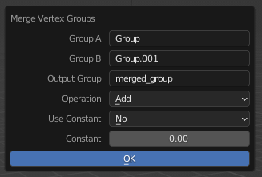
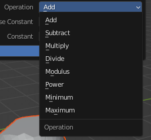
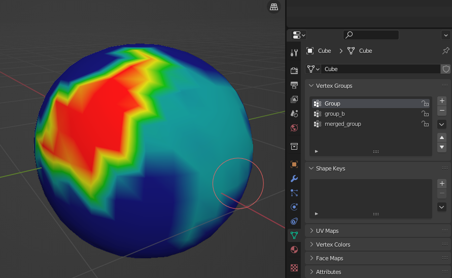
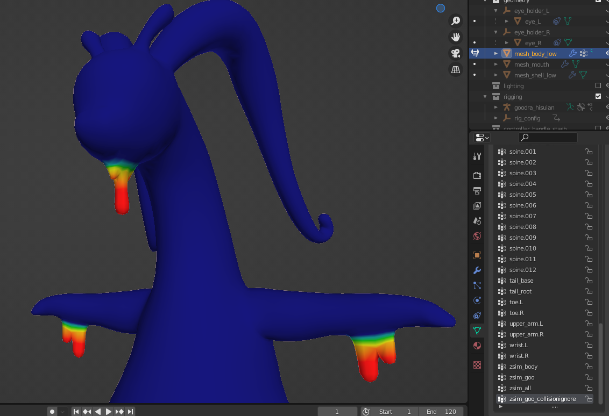

# Merge/Operate Vertex Groups
Run a math operation on one or two vertex groups. Useful for things like merging two vertex groups.

## Accessing
From Object mode, select the objects you want to edit, and go to `Object > Apply > Merge Vertex Groups`.
The operation should apply to all selected objects it can, which is useful for multi-mesh character rigs.

Or, if you're in Weight Paint Mode, simply go to `Weights > Merge Vertex Groups`.
This will allow real-time view of the operation if you make changes after applying it.
You can only do one object at a time with this method.

## Utilization
You should get a menu like this:

From here, fill out the names of the desired vertex groups you want to work with.
If you want to use a constant, select 'Use Constant' and choose where in the formula you want it to be used.
Then set the constant value. The constant value can be any float value--it is not clamped to 0 or 1.

Finally, select your operation. If you want to see what the formula looks like for each one, simply hover your mouse over the option.

## Lacking
Currently, all weight values are clamped to be between 0 and 1.
It may be ideal in the future to add an option to normalize the computed outputs instead, so if you had a wide range of values (say 0 to 100),
they get remapped to a range of 0 to 1, instead of clamped (and thus essentially ignoring 99% of the value range).

## Example - Combining Two Groups
My first vertex group:

Second group:

Simply add the weights together, and done!

## Example - Shrinking a Group
To shrink a vertex group, you can subtract the weight of the current group by a constant value.
This will remove any vertices with a weight less than the threshold value you supplied.
Notice how the weighting for the goo starts a little lower than before.

Afterward, you can normalize the group to get the full range of values again by using `Weights > Normalize`.
We shrunk the number of vertices in our vertex group, but retained the smoothness on the outer edge,
and also retained the strength of weighting in the primary area.

