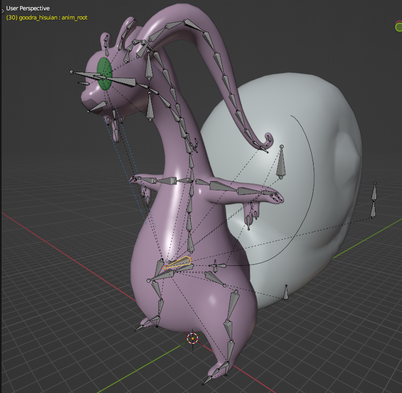
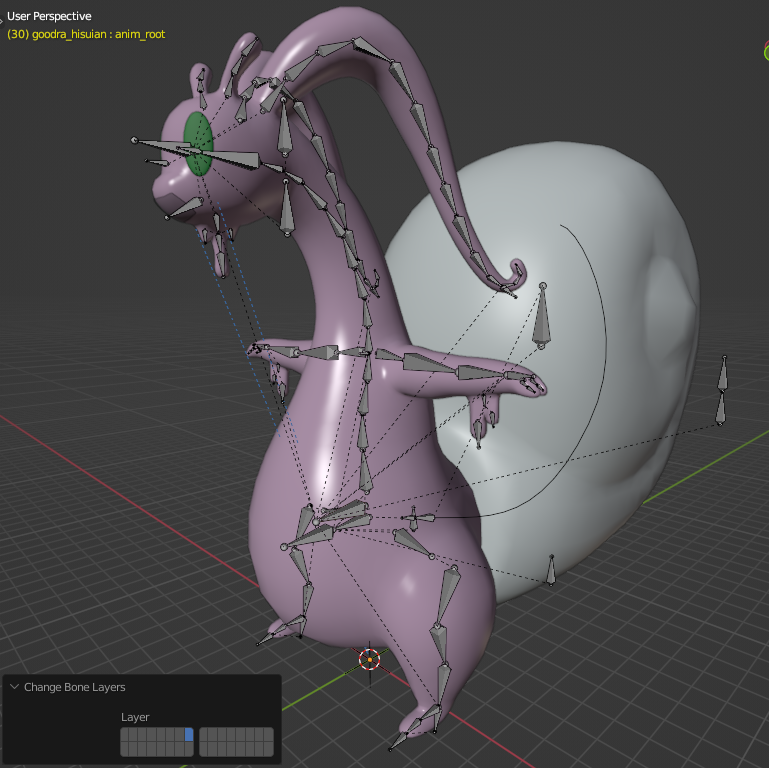

# Select End Bones
Selects bones at the bottom of the hiearchy. Made to work in tandem with Add Leaf Bones, but can be utilized for other purposes as well.

## Accessing
While editing an Armature, go to `Select > Select End Bones`.

## Use
Select the bones you want to get the chain ends of, and then run the tool.
Check "Ignore Non-Deforming" if you want to ignore stuff like IK Handles.

## Example - Adding Leaf Bones
Select the root bone of your armature in Edit mode.

Then run `Select > Select End Bones`--this should select all the outermost bones of your model.
If you use "Ignore Non-Deforming," it should not grab IK handles if you marked them properly! 

Afterward, run `Add > Add Leaf Bones`. Leaf bones will automatically be placed on these end bones, and selected.

Finally, run `Armature > Change Bone Layers` and select a new layer to hide the Leaf Bones while you continue working in Blender.

