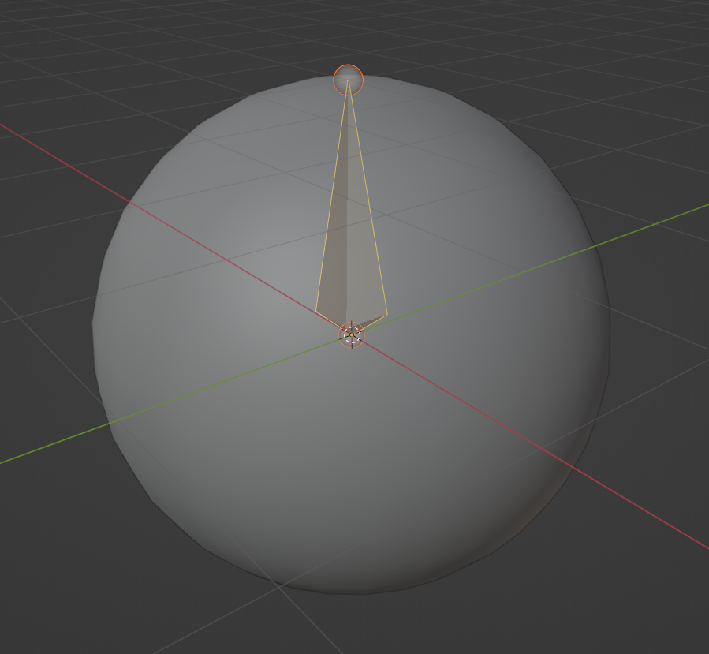
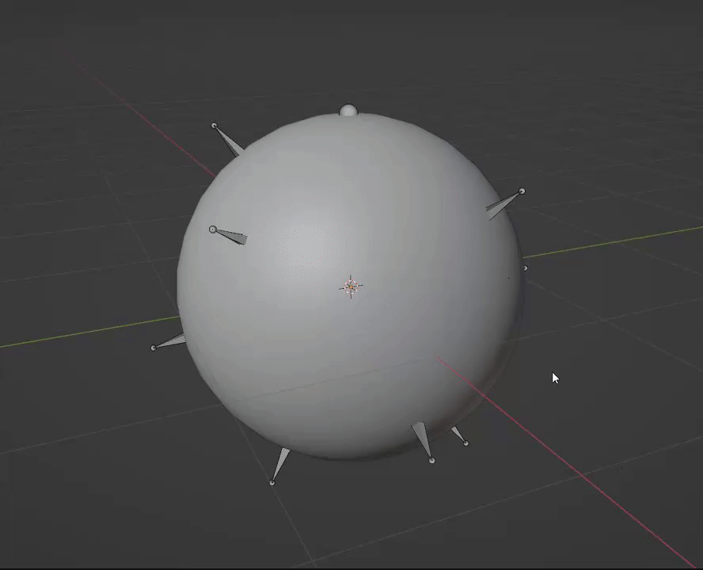

# Surface Bone Placer
This tool is nice for setting up controlled deforms on flesh, fluids, cloth, or other surfaces.
While blend shapes are in-theory a better practice for this need,
not everything supports them (i.e. less-developed game engines, and maybe Blender modifier stacks?), which is why I chose to do this with bones.
Personally, I'm also terrified of blend shapes since I have yet to learn them.

## Accessing
While editing an Armature, go to `Add > Place Surface Bones`. If you would like the bones you place to fall under a parent, make the parent bone active before running this tool.

## Use
Once the modal has started, left-click on 3D surfaces to place bones on them. The bone head will fall slightly inside the mesh, and the bone tail will face outward based off the surface normal. Bones should automatically inherit armature and parent bone transforms (essentially they are placed using global space). If there's an issue, let me know.

When you are finished placing bones, hit `Escape` to exit the modal. When using the placed bones, I recommend using Automatic Weights over Envelope weights for initial weighting of your mesh.

## Example - Deforming a Surface
Here I have a smoothed sphere, and I threw an armature on it with a single root bone, which I made active by clicking on it.

After that, I activated the tool and clicked on various points on the sphere to place bones where I wanted.
I then hit `Escape` to exit placement mode and finalize my changes.

Next, I disabled deform on my root bone so that only my placed bones will deform the sphere.
Finally, I parented the sphere to my armature, and used the "with automatic weights" setting so I didn't have to manually weight-paint everything...and it works!

